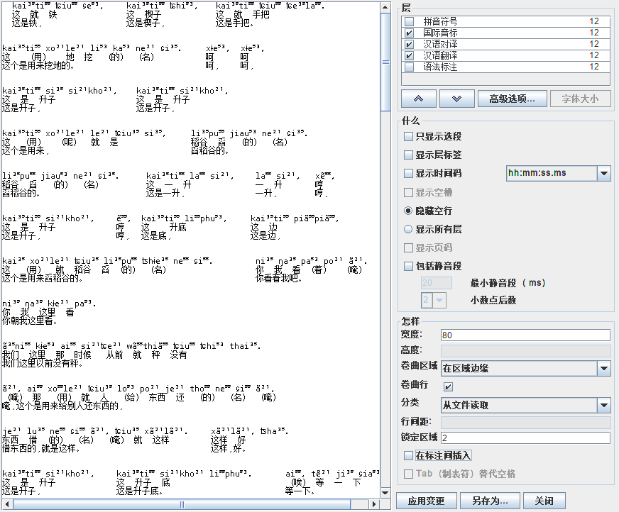

# 土家语——`ELAN`数据转`Latex`排版说明

## 1. ELAN数据导出说明

**注意事项**

* `ELAN`版本`5.0`以上，以最新版本为主;
* 导出时需保证有且只有**三层**语法，包括`国际音标`、`汉语对译`、`汉语翻译`，顺序如下;
```text
第一层：国际音标
第二层：汉语对译
第三层：汉语翻译
```
* 取消`显示层标签`选项，点击`应用变更`可查看是否生效；
* 需保证`国际音标`中词数量 == `汉语对译`中词语数量，否则报错;
* 在`国际音标`和`汉语对译`中，需保证单词（包含标点）需不包含无空格或`Tab`，词与词间必须至少包含一个空格或`Tab`;
* `汉语翻译`层，不硬性要求间隔，最终都会剔除;
* 其它选项可对照下图。
  

* 导出文件命名请依据文本中心内容，该命名可能写入latex排版中


## 2. python脚本说明

#### python版本和依赖包说明

* python版本: 3.6以上
* python包：thinker
#### 运行流程

1. ELAN导出文件到rawText文件夹下

2. 运行script/form_dict.py ，保证无未知字符

3. 运行script/auto_stand.py，用于检查是否有格式错误

4. 运行script/auto_trans.py，会在result中生成LateX语法的文本

5. 将result中文本复制到Tex环境中编译
## 3. Latex排版说明

### 3.1 页面数据

采用`a5`纸张，148mm×210mm 上下左右留白20mm
### 3.2 文本所采用字体说明

| 类型 | 字体 | 字号 | 版本|
|:----:|:----:|:----:|:-----:|
|ASCI所规定的字符|Times New Roman| 9 |  6.98|
|汉字| SimSun(宋体) | 9 | 5.15|
|国际音标字符| TeX\040tipa10  | 9 |001.001|

拼音 + 国际音标 + 对译 实施一对一对齐，形成一列（左对齐）；列与列间两个字符对其 


### 3.2 自动换行说明

#### 换行补行逻辑

```text
if 上一次剩余长度 < 50%
    放弃补行，新起一行
    
if 剩余长度 + 5% >= 全行长度        # 空行剩余长度为100%
    补行


```


## 4. 错误类型注解

有可能仅抛出一个错误，但是可能存在多种错误，仅抛出检测出的第一项错误

* 转译库缺失

原因：不存在转译库文件

*XX行，xx句*
* 层缺失（国际音标、汉语対译、汉语翻译）

原因：标注层不全，缺少某层

* 对译无法对齐
原因： `国际音标`和`汉语对译`无法一一对齐

* 字符缺失（缺失字符）

原因：存在无法转译的字符，或字符未在库中，具体库见`doc`文件夹下`dict.csv`文件

